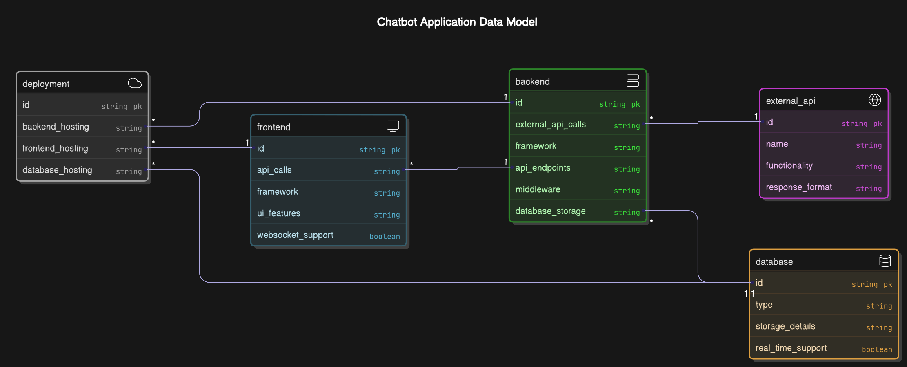
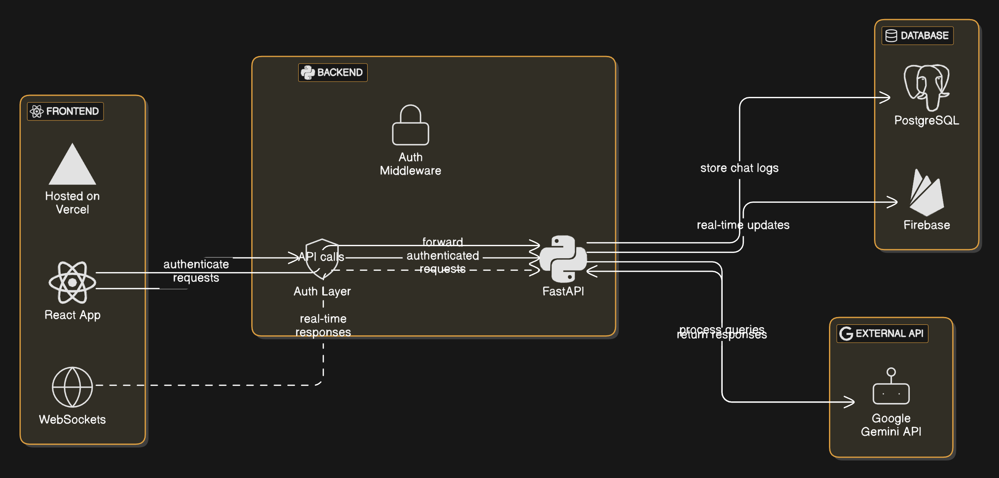

# 🌾 AgriGenie – AI Chatbot for Farmers & Agribusiness - INPROGRESS 

AgriGenie is an AI-powered chatbot designed to assist farmers and agribusinesses by providing smart recommendations, pest identification, weather-based insights, and product guidance in multiple languages.  

## 🚀 Features  
✅ Will add soon

## 🛠 Tech Stack  
- **Frontend:** ReactJS + Vite
- **Backend:** FastAPI 

## 🏗 Architecture  
### ER Diagram  

### Flow Diagram  

